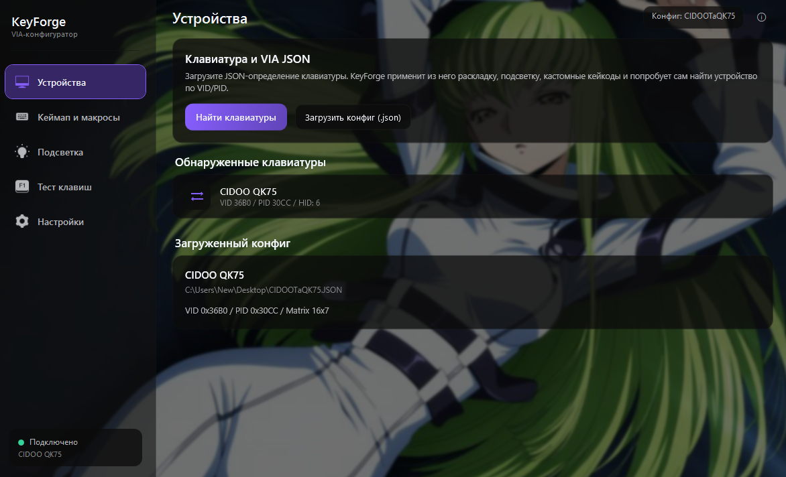
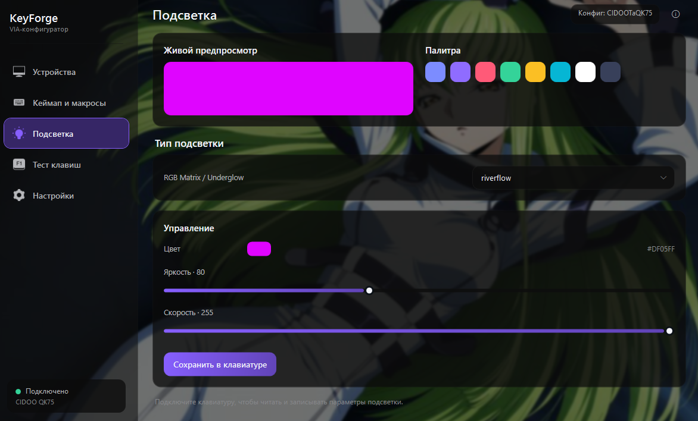
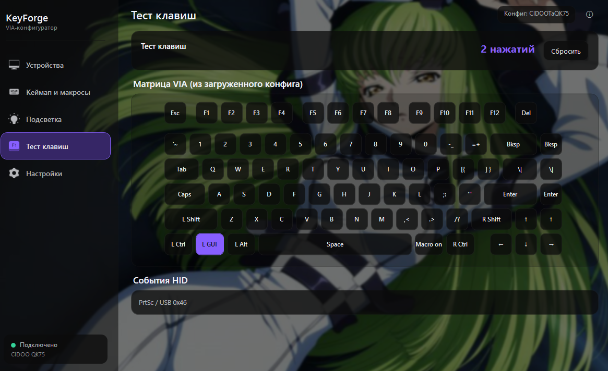
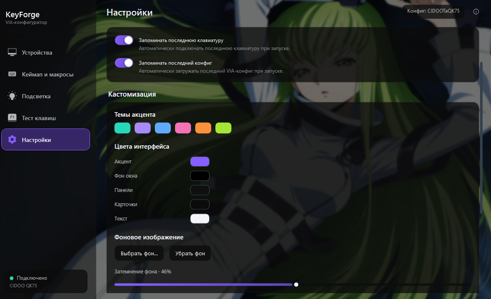

# KeyForge

Нативное приложение для настройки клавиатур через VIA-протокол с поддержкой JSON-конфигураций без использования браузера.

[](https://opensource.org/licenses/MIT)
[]()
[]()

## Особенности

- Нативное приложение, работающее быстрее браузерной версии
- Поддержка JSON-конфигураций для загрузки пользовательских раскладок
- Автоматическое определение клавиатуры при подключении
- Фон: картинки, GIF и видео; плавный скролл; перетаскивание блоков
- Проверка обновлений с GitHub Releases

## Скриншоты


*Основной интерфейс настройки*


*Назначение клавиш*


*Настройка подсветки*


*Редактор макросов*

## Быстрый старт

Готовый установщик — в разделе [Releases](https://github.com/zxchm0nya/KeyForge/releases).

### Сборка из исходников

```bash
git clone https://github.com/zxchm0nya/KeyForge.git
cd KeyForge

# Сборка приложения
dotnet build KyeForge.sln -c Release

# Или полный релиз (app + installer)
powershell -ExecutionPolicy Bypass -File build.ps1
```

## Структура

- `KyeForge.App` — основное приложение (WPF)
- `KyeForge.Installer` — установщик
- `build.ps1` — чистка, сборка, упаковка setup
